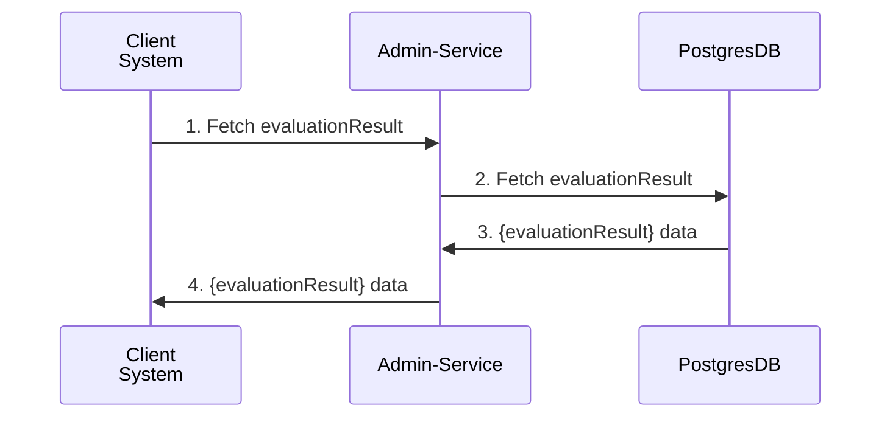
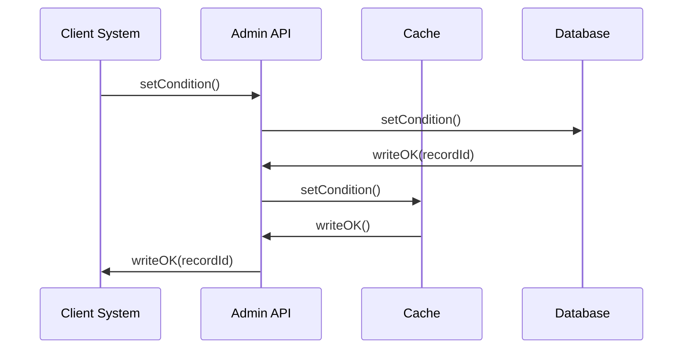
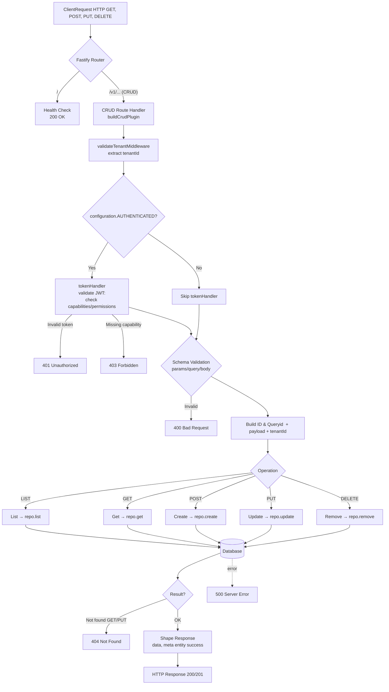

<!-- SPDX-License-Identifier: Apache-2.0 -->
# Admin Service Documentation

## Overview

The **Admin Service** is a Node.js-based API designed for administrative tasks, with a particular focus on report and condition management. It utilizes the Fastify framework to deliver a high-performance and low-overhead API interface. This document offers an in-depth examination of the API, covering setup requirements, a comprehensive overview of the application, and detailed route documentation.

## Pre-requisites

Before you start using the Admin API, ensure that you have the following items:

1. **Node.js**: Version 20.x or higher.
    - Download from [Node.js Official Website](https://nodejs.org/).
    - Verify installation using `node -v` and `npm -v`.

2. **NPM**: A package manager for Node.js packages.
    - NPM is installed with Node.js.

3. **Git**: Version control system for cloning the repository.
    - Download from [Git Official Website](https://git-scm.com/).

4. **Database**: Postgres database setup.
    - Ensure the database is running and accessible from your Node.js environment.

5. **Environment Variables**: Set up environment variables required by the application, such as database connection strings. Typically stored in a `.env` file.

## Installation and Setup

1. **Clone the Repository**:
    ```bash
    git clone https://github.com/@frmscoe/admin-service.git
    cd admin-service
    ```

2. **Install Dependencies**:
    ```bash
    npm install
    ```

3. **Configure Environment Variables**:
    - Create a `.env` file in the root directory and add necessary configuration values

4. **Run the Server**:
    ```bash
    npm run start
    ```

5. **Access the API**:
    - The server runs on `http://localhost:3000` by default. You can access the API via your browser or any HTTP client like Postman.

## API Endpoints

### 1. Get report by message id 

#### Description
This endpoint retrieves a report by the specified message ID (`msgid`). The message ID is provided as a query parameter.

#### Flow Diagram


#### URL
```
/v1/admin/reports/getreportbymsgid
```

#### Method
```
GET
```

#### Query Parameters

| Parameter | Type   | Required | Description                     |
|-----------|--------|----------|---------------------------------|
| `msgid`   | String | Yes      | The message ID to get the report for. |

#### Headers
No specific headers required apart from standard authentication headers if needed.

### Request Example
```http
GET /v1/admin/reports/getreportbymsgid?msgid=1234567890 HTTP/1.1
```

#### Response

- **Status 400 Bad Request:** When `msgid` is missing or invalid.
    ```json
    {
      "statusCode": 400,
      "code": "FST_ERR_VALIDATION",
      "error": "Bad Request",
      "message": "querystring must have required property 'msgid'"
    }
    ```

- **Status 204 Not Found:** When no report is found for the given `msgid`.
    ```json
    {
      "statusCode": 204,
    }
    ```

- **Status 500 Internal Server Error:** For server-side errors.
    ```json
    {
      "status": "error",
      "message": "Internal server error occurred."
    }
    ```


### 2. Condition Management
##### a. `/v1/admin/event-flow-control/entity`
##### b. `/v1/admin/event-flow-control/account`

#### Description

Both endpoints are responsible for storing conditions related to their specific accounts or entities. They are expected to store condition edges within the in-memory system and have different methods assigned to each endpoint: GET, POST, and PUT.

GET endpoints are used to retrieve data already stored by a POST request. You can use the SyncCache parameter to either sync active conditions or not. PUT endpoints are responsible for updating the expiry date of a specified condition.

#### Flow Diagram


#### URL 1
```
/v1/admin/event-flow-control/entity
```
#### Methods FOR URL 1
```
POST, GET, PUT
```

#### URL 2
```
/v1/admin/event-flow-control/account
```
#### Methods FOR URL 2
```
POST, GET, PUT
```

**Some endpoints share properties except for ntty and acct. These properties are specific to each endpoint and indicate the governing condition**
#### Body 
#### URL 1, 2 POST METHOD
| Parameter | Type   | Required | Description                     |
|-----------|--------|----------|---------------------------------|
| `evtTp`   | Array | Yes      | Event types |
| `condTp`   | String | Yes      | Condition type. |
| `prsptv`   | String | Yes      | Perspective of the condition. |
| `incptnDtTm`   | String | Yes      | Inception date. |
| `xprtnDtTm`   | String | Yes      | Expiration date. |
| `condRsn`   | String | Yes      | Reason code. |
| `forceCret`   | Boolean | Yes      | Flag indicating whether the entity should be created if it does not exist. |
| `usr`   | String | Yes      | User that triggered the operation. |
#### URL 1 POST METHOD
| Parameter | Type   | Required | Description                     |
|-----------|--------|----------|---------------------------------|
| `ntty`   | Object | Yes      | The entity object that the condition is governed by. |
#### URL 2 POST METHOD
| Parameter | Type   | Required | Description                     |
|-----------|--------|----------|---------------------------------|
| `acct`   | Object | Yes      | The account object that the condition is governed by. |
#### URL 1 GET METHOD
| Parameter | Type   | Required | Description                     |
|-----------|--------|----------|---------------------------------|
| `id`   | String | Yes      | Entity identifier |
| `schmenm`   | String | Yes      |  Scheme name of the entity |
| `synccache`   | String | No      | Accepts `all`, `active`, `default` or `no`  |
| `activeonly`   | String | No      | Accepts `yes`, or `no`  |
#### URL 2 GET METHOD
| Parameter | Type   | Required | Description                     |
|-----------|--------|----------|---------------------------------|
| `id`   | String | Yes      | Entity ID. |
| `schmenm`   | String | Yes      | Scheme name of the account |
| `agt`   | String | Yes      | proprietary agent identifier |
| `synccache`   | String | No      | Accepts `all`, `active`, `default` or `no`  |
| `activeonly`   | String | No      | Accepts `yes` or `no`  |
#### URL 1 PUT METHOD
| Parameter | Type   | Required | Description                     |
|-----------|--------|----------|---------------------------------|
| `id`   | String | Yes      | Entity identifier |
| `schmenm`   | String | Yes      |  Scheme name of the entity |
| `condId`   | String | Yes      | Condition identifier  |
#### Body data
| Body | Type   | Required | Description                     |
|-----------|--------|----------|---------------------------------|
| `xprtnDtTm`   | String | No      | New timedate of the condition |
#### URL 2 PUT METHOD
| Parameter | Type   | Required | Description                     |
|-----------|--------|----------|---------------------------------|
| `id`   | String | Yes      | Entity ID. |
| `schmenm`   | String | Yes      | Scheme name of the account |
| `agt`   | String | Yes      | proprietary agent identifier |
| `condId`   | String | Yes      | Condition identifier  |
#### Body data
| Body | Type   | Required | Description                     |
|-----------|--------|----------|---------------------------------|
| `xprtnDtTm`   | String | No      | New timedate of the condition |

> [!IMPORTANT]  
> Ensure your query parameters are encoded as some properties can contain special characters. An `id` of `+12344567890` would need to be encoded as `+` is a special character.

Possible values for some fields mention in the table above
1. **evtTp**  : [`'pacs.008.001.10'`,`'pacs.002.001.12'`,`'pain.001.001.11'`,`'pain.013.001.09'` or `'all'`]
2. **condTp** : `non-overridable-block` or `override` or `overridable-block`
3. **prsptv** : `both` or `creditor` or `debtor`

**ntty object for :** `URL 1`
```JSON
{
  "id": "string",
  "schmeNm": {
    "prtry": "string"
  }
}
```

**acct object for :** `URL 2`
```JSON
{
  "id": "string",
  "schmeNm": {
      "prtry": "string"
  },
  "agt": {
    "finInstnId": {
      "clrSysMmbId": {
        "mmbId": "string"
      }
    }
  }
}
```

#### Headers
No specific headers required for both endpoints.


```http
POST /v1/admin/event-flow-control/entity HTTP/1.1
```

#### Response

- **Status 400 Bad Request:** When `prsptv` is missing or invalid.
    ```json
    {
      "statusCode": 400,
      "code": "FST_ERR_VALIDATION",
      "error": "Bad Request",
      "message": "body must have required property 'prsptv'"
    }
    ```

- **Status 500 Not Found:** When account was not found in the database and forceCret was set to false
    ```json
    {
      "statusCode": 500,
      "message": "Error: account was not found and we could not create one because forceCret is set to false"
    }
    ```

- **Status 500 Internal Server Error:** For server-side errors.
    ```json
    {
      "status": "error",
      "message": "Internal server error occurred."
    }
    ```

```http
POST /v1/admin/event-flow-control/account HTTP/1.1
```

#### Response

- **Status 400 Bad Request:** When `condTp` is missing or invalid.
    ```json
    {
      "statusCode": 400,
      "code": "FST_ERR_VALIDATION",
      "error": "Bad Request",
      "message": "body must have required property 'condTp'"
    }
    ```

- **Status 500 Not Found:** When expiration date is before inception date.
    ```json
    {
      "statusCode": 500,
      "message": "Error: Expiration date must be after inception date."
    }
    ```

- **Status 500 Internal Server Error:** For server-side errors.
    ```json
    {
      "status": "error",
      "message": "Internal server error occurred."
    }
    ```
    
### Refreshing cache

```http
PUT /v1/admin/event-flow-control/cache HTTP/1.1
```

#### Response

- **Status 204 No Content:** Cache has been updated

--------

#  Repository CRUD Design Pattern


## 1) Repository Overview

Repositories provide a clear abstraction between the data layer and the API layer. Each repository implements the standard CRUD interface, handling data persistence logic independently from HTTP routing or validation concerns.


---

## 2) Request → Auth → CRUD → Repository Flow



## 3) Responsibilities of the Repository

Each repository implementation follows a standardized interface, ensuring consistent behavior across different entity types. The key responsibilities include:

* **Data Retrieval:** Executing parameterized SQL queries to list and fetch records from a table.
* **Entity Creation:** Inserting new configuration entries into the target table.
* **Entity Updating:** Replacing existing configuration data for a specific tenant and configuration key.
* **Entity Deletion:** Removing entries that match provided identifiers.
* **Filtering and Sorting:** Supporting dynamic filters and ordering for list operations.

**We have 3 different repositories :**

| No. | Config  | File name | Endpoint | Methods | 
| --- | --- | --------- | -------- | ----------- | 
| 1. | Network Map | network.map.repository | `/v1/admin/configuration/network_map` |  GET,POST,PUT,DEL |
| 2. | Rule Configuration |  rule.config.repository | `/v1/admin/configuration/rule` |  GET,POST,PUT,DEL |
| 3. | Typology Configuration | typology.config.repository | `/v1/admin/configuration/typology` | GET,POST,PUT,DEL |

---

## 4) Conceptual Flow of Operations

### List Operation

When listing entities, the repository constructs a SQL statement dynamically using optional filters and sort parameters. Tenant ID is always included to ensure the query operates within the tenant’s data domain.

The result is normalized into a consistent `{ data, total }` format expected by the CRUD plugin.

### Get Operation

The `get` method retrieves a single entity record based on the combination of ID, and tenantId. If the record exists, it returns the parsed configuration object.

### Create Operation

The creation method inserts a new configuration entry into the database. The payload is augmented with the tenant identifier from auth token before being stored. The inserted configuration is returned as confirmation.

### Update Operation

The update process replaces an existing configuration record that matches the composite key (`id`, `payload: configuration`, and `tenantId`). The repository ensures atomic updates by returning the modified record upon success or `null` if the record does not exist.

### Delete Operation

The deletion process removes the record from the table matching the same composite identifiers (id and tenantId). It returns a boolean indicating success, enabling the API to respond with a standardized `{ success: boolean }` payload.

---

## 5) Error Handling and Query Safety

The repository leverages parameterized SQL queries to prevent injection vulnerabilities. The database interaction utility (`handlePostExecuteSqlStatement`) encapsulates execution, result parsing, and mapping logic. Each operation validates the query result and enforces type consistency.

Failures such as missing records or constraint violations are surfaced gracefully, allowing the CRUD layer to translate them into HTTP responses.

---

## 6) Integration with the CRUD Plugin

The repository is registered with the CRUD plugin builder using its entity schema and API prefix. Once registered, all HTTP routes automatically delegate database interactions to this repository. The plugin handles:

* Request validation
* Parameter parsing
* Tenant enforcement
* Response shaping

This ensures that the repository remains focused solely on persistence logic.

---

## 7) Best Practices for Repository Design

* **Enforce Tenant Boundaries:** Always include `tenantId` in filters and write conditions.
* **Use Parameterized Queries:** Prevent injection and maintain predictable execution plans.
* **Keep Repositories Pure:** Avoid embedding business logic or request-side context in repositories.
* **Normalize Outputs:** Ensure all methods return predictable structures (`{ data, total }`, `TEntity | null`, `boolean`).
* **Support Configurable Filtering:** Design flexible filters for future extensibility.

---

## 8) Claims & Tokens

This section describes how claims-based tokens are used for authentication and authorization across CRUD endpoints, what claims to include, and the trade‑offs of this approach.

### 7.1 Token Models

**Authorization claims**

* `permissions` (or `capabilities`): **Fine‑grained action strings** aligned to route capabilities (see 7.2). Example: `GET_V1_ADMIN_CONFIGURATION_RULE`.

**Tenancy & configuration claims**

* `tenantId`: The caller’s tenant context (MUST be bound to all data operations).
* `payload: cfg`: Configuration partition/variant required by repositories.

### 7.2 Mapping Claims to CRUD Endpoints

Use **capability-style permissions** that the API checks per request via the token handler. Capabilities are derived as:

```
<METHOD><PREFIX_WITH_SLASHES_AS_UNDERSCORES_UPPERCASE>
```
PREFIX example: `v1/admin/configuration/rule`

For the configuration entities shown earlier, recommended permission strings include:

* `LIST_V1_ADMIN_CONFIGURATION_NETWORK_MAP`

* `GET_V1_ADMIN_CONFIGURATION_NETWORK_MAP`

* `POST_V1_ADMIN_CONFIGURATION_NETWORK_MAP`

* `PUT_V1_ADMIN_CONFIGURATION_NETWORK_MAP`

* `DELETE_V1_ADMIN_CONFIGURATION_NETWORK_MAP`

* `LIST_V1_ADMIN_CONFIGURATION_RULE`

* `GET_V1_ADMIN_CONFIGURATION_RULE`

* `POST_V1_ADMIN_CONFIGURATION_RULE`

* `PUT_V1_ADMIN_CONFIGURATION_RULE`

* `DELETE_V1_ADMIN_CONFIGURATION_RULE`

* `LIST_V1_ADMIN_CONFIGURATION_TYPOLOGY`

* `GET_V1_ADMIN_CONFIGURATION_TYPOLOGY`

* `POST_V1_ADMIN_CONFIGURATION_TYPOLOGY`

* `PUT_V1_ADMIN_CONFIGURATION_TYPOLOGY`

* `DELETE_V1_ADMIN_CONFIGURATION_TYPOLOGY`

> The token handler should accept **any** of the above capabilities depending on the endpoint being accessed. A default‑deny policy is recommended when the claim is missing.


### 7.6 Best Practices

* **Bind to tenant & payload:cfg:** Enforce `tenantId` and `payload:cfg` presence and consistency on every request.
* **Version capabilities:** Namespace or version permission strings when APIs evolve (e.g., `GET_V1_...`).

---

**Notes**

* `tenantId` is established by middleware and injected into every repository call.
* `id: identifier` is provided as a path segment for GET/PUT/DELETE and included in ID construction.
* Capability strings follow the `<METHOD><PREFIX_WITH_SLASHES_AS_UNDERSCORES>` pattern (e.g., `GET_V1_ADMIN_CONFIGURATION_RULE`).

---

## 8) Summary

The repository pattern isolates data persistence logic from application behavior. In the context of Fastify and the CRUD plugin system, it:

* Promotes maintainable and testable data logic.
* Provides a clean boundary for tenant-aware, configuration-driven operations.
* Supports consistent integration with RESTful endpoints.