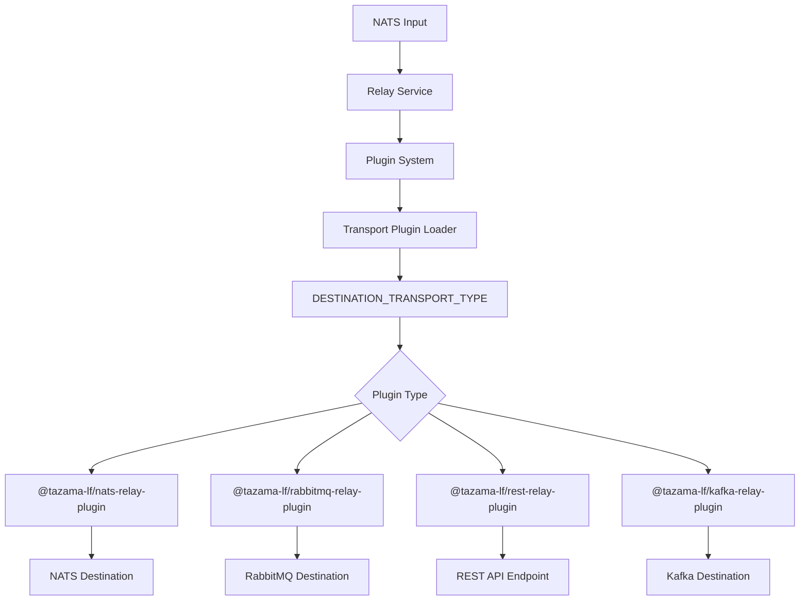
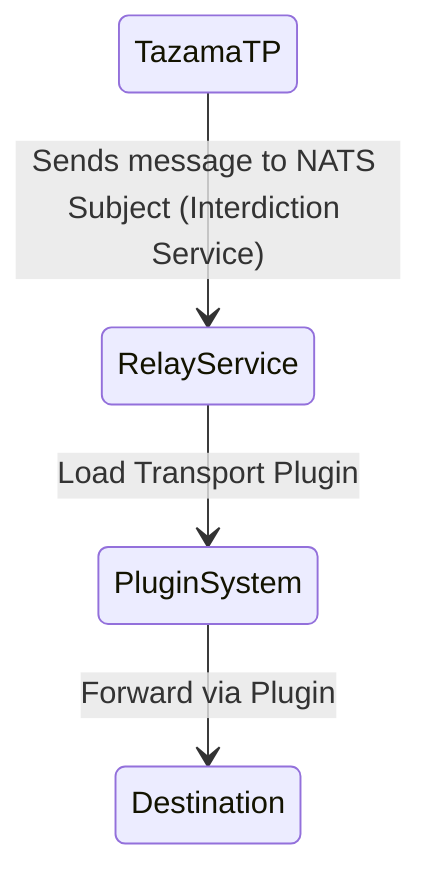
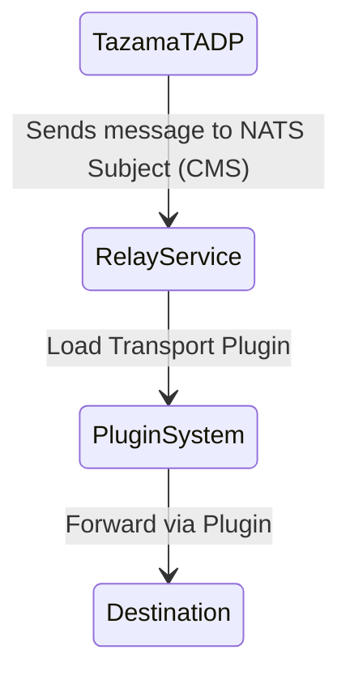

# **Tazama Relay Service**

## _Relay Service Documentation_

**Table of Contents**

- [**Tazama Relay Service**](#tazama-relay-service)
  - [_Relay Service Documentation_](#relay-service-documentation)
  - [**_1. Component Overview_**](#1-component-overview)
    - [1.1 An overview of the document and its purpose](#11-an-overview-of-the-document-and-its-purpose)
    - [1.2 Features](#12-features)
    - [1.3 Major Functions](#13-major-functions)
      - [Start Function](#start-function)
      - [Transport Plugin System](#transport-plugin-system)
      - [Execute Function](#execute-function)
      - [Relay Message Function](#relay-message-function)
  - [**_2. System Architecture_**](#2-system-architecture)
    - [2.1 Plugin-Based Transport Architecture](#21-plugin-based-transport-architecture)
    - [2.2 Relay Service to NATS / RabbitMQ / REST API / Kafka for TazamaTP](#22-relay-service-to-nats--rabbitmq--rest-api--kafka-for-tazamatp)
    - [2.3 Relay Service to NATS / RabbitMQ / REST API / Kafka for TazamaTADP](#23-relay-service-to-nats--rabbitmq--rest-api--kafka-for-tazamatadp)
  - [**_3. Configuration_**](#3-configuration)
    - [3.1 Transport Plugin System](#31-transport-plugin-system)
    - [Environment Variables](#environment-variables)
      - [Core Service Variables](#core-service-variables)
      - [APM Configuration](#apm-configuration)
      - [Logging Configuration](#logging-configuration)
    - [3.2 Example Configuration](#32-example-configuration)
  - [**_4. Deployment Guide_**](#4-deployment-guide)
    - [Pre-requisites](#pre-requisites)
    - [Step-by-Step Deployment Instructions](#step-by-step-deployment-instructions)
  - [**_5. Running the Service_**](#5-running-the-service)
    - [5.1 Service Initialization](#51-service-initialization)
    - [5.2 Message Processing Flow](#52-message-processing-flow)
    - [5.3 Starting the Service](#53-starting-the-service)
  - [**_6. Contributor Information_**](#6-contributor-information)

## **_1. Component Overview_**

It is a TypeScript-based service that bridges communication between TMS
(Tazama Monitoring Service) and client applications handling transaction
processing and analysis.

### 1.1 An overview of the document and its purpose

This service acts as an intermediary, reading messages from a NATS server.
Forwarding them to various client-side message queue implementations,
including RabbitMQ, REST API, or NATS.
Its primary purpose is to facilitate seamless communication between TMS and
transaction processing/analysis applications.

### 1.2 Features

- Consumes NATS messages
- **Plugin-based transport system** for extensible destination support
- Compatible with various output destinations through transport plugins
  (NATS, RabbitMQ, REST API, Kafka)
- Dynamic plugin loading and installation at runtime
- Support for both JSON and Protobuf message formats
- Built using TypeScript for enhanced type safety and maintainability
- Comprehensive APM (Application Performance Monitoring) integration
- Designed specifically for financial risk management and transaction
  processing scenarios

### 1.3 Major Functions

The Message Relaying Service offers several core functions that work
together to enable efficient message forwarding through a plugin-based
transport system. These functions are designed to handle different aspects
of the message relaying process.

- ### Start Function

```typescript
startRelayServices: () => Promise<void>;
```

The `startRelayServices` function initializes the service by:

1. Setting up subscribers to read messages from the configured input source
   using [`frms-coe-startup-lib`](https://github.com/tazama-lf/frms-coe-startup-lib)
2. Dynamically loading and initializing the configured transport plugin
3. Providing an `execute` function (with custom implementation) to be called
   whenever a NATS message is received
4. Implementing connection retry logic (up to 10 retries) for robust service
   startup

- ### Transport Plugin System

The service uses a dynamic plugin system for handling different destination
types:

```typescript
initTransport: (configuration: Configuration, loggerService: LoggerService) => Promise<ITransportPlugin>;
```

This system:

- Dynamically installs transport plugins using npm at runtime
- Loads plugins at runtime based on `DESTINATION_TRANSPORT_TYPE`
  configuration
- Validates plugin structure and ensures proper interface implementation
- Supports extensible architecture for adding new transport destinations

- ### Execute Function

```typescript
execute: (reqObj: unknown) => Promise<void>;
```

The execute function processes incoming messages by:

- Handling both JSON and Protobuf message formats based on `OUTPUT_TO_JSON`
  configuration
- Creating APM transactions for performance monitoring
- Converting messages to appropriate format (JSON string or Protobuf buffer)
- Calling the transport plugin's relay method to forward messages
- Providing comprehensive error handling and logging

- ### Relay Message Function

```typescript
transport.relay: (message: Uint8Array | string) => Promise<void>
```

This function acts as the central hub for message forwarding through the
loaded transport plugin. The actual implementation depends on the specific
transport plugin being used (NATS, RabbitMQ, REST API, etc.).

## **_2. System Architecture_**

This section provides an overview of how the Relay Service interacts with
different components in the Tazama ecosystem. The service uses a
**plugin-based architecture** where transport plugins are dynamically
loaded to handle different destination types. The diagrams illustrate the
flow of messages from TazamaTP and TazamaTADP through the Relay Service to
various destinations.

### 2.1 Plugin-Based Transport Architecture



### 2.2 Relay Service to NATS / RabbitMQ / REST API / Kafka for TazamaTP



### 2.3 Relay Service to NATS / RabbitMQ / REST API / Kafka for TazamaTADP



## **_3. Configuration_**

The service can be configured through environment variables or a
configuration file. Refer to the `.env` file or `src/config.ts` file for
available settings.

### 3.1 Transport Plugin System

The service uses a plugin-based architecture where transport destinations
are implemented as npm packages. The `DESTINATION_TRANSPORT_TYPE`
environment variable specifies which plugin to load:

 - KAFKA - https://github.com/tazama-lf/relay-service-integration-kafka
    - `DESTINATION_TRANSPORT_TYPE = @tazama-lf/kafka-relay-plugin`
 - NATS - https://github.com/tazama-lf/relay-service-integration-nats
    - `DESTINATION_TRANSPORT_TYPE = @tazama-lf/nats-relay-plugin`
 - RABBIT MQ - https://github.com/tazama-lf/relay-service-integration-rabbitmq
    - `DESTINATION_TRANSPORT_TYPE = @tazama-lf/rabbitmq-relay-plugin`
 - REST API - https://github.com/tazama-lf/relay-service-integration-rest
    - `DESTINATION_TRANSPORT_TYPE = @tazama-lf/rest-relay-plugin`

Plugins are automatically installed and loaded at runtime using the plugin
loading system.

- ## _Environment Variables_

The service can be configured using the following environment variables:

- ### Core Service Variables

| Variable                   | Description                          | Required |
| -------------------------- | ------------------------------------ | -------- |
| STARTUP_TYPE               | nats                                 | Yes      |
| NODE_ENV                   | Node.js environment (e.g., prod,     | Yes      |
|                            | dev)                                 |          |
| SERVER_URL                 | NATS server URL for input            | Yes      |
| FUNCTION_NAME              | Name of the function associated      | Yes      |
|                            |                                      |          |
| CONSUMER_STREAM            | Name of the NATS consumer            | Yes      |
| PRODUCER_STREAM            | Stream/queue name for destination    | Yes      |
|                            | (plugin-dependent)                   |          |
| OUTPUT_TO_JSON             | Message format: "true" for JSON,     | Yes      |
|                            | "false" for Protobuf                 |          |
| DESTINATION_TRANSPORT_TYPE | Package name of the transport plugin | Yes      |
|                            |                                      |          |
| MAX_CPU                    | CPU Limit for LoggerService          | Yes      |

- ### APM Configuration

| Variable         | Description                      |
| ---------------- | -------------------------------- |
| APM_ACTIVE       | Enables Elastic APM (true/false) |
| APM_SERVICE_NAME | APM Service name                 |
| APM_URL          | APM server URL                   |
| APM_SECRET_TOKEN | APM Secret token                 |

- ### Logging Configuration

| Variable       | Description                                                 |
| -------------- | ----------------------------------------------------------- |
| LOGSTASH_LEVEL | Log level                                                   |
| SIDECAR_HOST   | [event sidecar](https://github.com/tazama-lf/event-sidecar) |
|                | (default: 0.0.0.0:15000)                                    |

**Note:** The `PRODUCER_STREAM` variable is required even when using
non-NATS destination plugins, as the service uses NATS to receive input
messages. For non-NATS destinations, this can be set to any default string
value.

### 3.2 Example Configuration

Here's an example `.env` configuration for using the NATS transport plugin:

```env
# Input NATS Configuration
STARTUP_TYPE=nats
NODE_ENV=dev
SERVER_URL=nats:4222
FUNCTION_NAME=messageRelayService
CONSUMER_STREAM=interdiction-service
PRODUCER_STREAM=destination.subject
DESTINATION_TRANSPORT_TYPE=@tazama-lf/nats-relay-plugin
OUTPUT_TO_JSON=true

# APM Configuration
APM_ACTIVE=false
APM_SERVICE_NAME=relay-service
APM_URL=http://localhost:8200/

# Logging Configuration
LOGSTASH_LEVEL=info
SIDECAR_HOST=0.0.0.0:15000
```

## **_4. Deployment Guide_**

### **Pre-requisites:**

Before starting, ensure the following is in place:

- Docker is installed on your system
- Node.js (version 20 or higher) is installed
- You have access to the repository that contains the Relay Service code
- You have `GH_TOKEN` set in your environment for private npm packages

### **Step-by-Step Deployment Instructions:**

#### 1. Clone the Repository

Open your terminal and run the following command to clone the repository:

```bash
git clone <repository-link>
cd relay-service
```

#### 2. Install Dependencies

Install the required dependencies:

```bash
npm install
```

#### 3. Configure Environment Variables

Copy the `.env.template` file to `.env` and update it according to your
system's requirements:

```bash
cp .env.template .env
# Edit .env with your specific configuration
```

Make sure to configure:

- NATS connection details for input
- Transport plugin type and destination details
- APM and logging settings

#### 4. Build the Application

Build the TypeScript application:

```bash
npm run build
```

#### 5. Run the Service

##### Option A: Direct Node.js

```bash
npm start
```

##### Option B: Development Mode

```bash
npm run dev
```

##### Option C: Docker

Build and run using Docker:

```bash
docker compose build
docker compose up -d
```

## **_5. Running the Service_**

Once configured, the service operates through the following process:

### 5.1 Service Initialization

1. **Plugin Loading**: The service dynamically loads the transport plugin
   specified by `DESTINATION_TRANSPORT_TYPE`
2. **Plugin Installation**: If needed, the plugin is installed using npm
   install at runtime
3. **Transport Initialization**: The loaded plugin is initialized with
   logger and APM instances
4. **NATS Connection**: Connection to the input NATS server with retry logic
   (up to 10 attempts)
5. **Subscriber Setup**: Subscribes to the configured `CONSUMER_STREAM` for
   incoming messages

### 5.2 Message Processing Flow

1. **Message Reception**: Receives messages from the configured NATS subject
   (`CONSUMER_STREAM`)
2. **Format Conversion**: Converts messages to JSON or Protobuf format based
   on `OUTPUT_TO_JSON` setting
3. **APM Tracking**: Creates APM transactions for performance monitoring
4. **Plugin Relay**: Forwards messages through the loaded transport plugin
5. **Error Handling**: Logs errors and continues processing without stopping
   the service

### 5.3 Starting the Service

#### Development Mode

```bash
npm run dev
```

#### Production Mode

```bash
npm run build
npm start
```

#### Docker Mode

```bash
docker-compose up -d
```

The service continues to operate until manually stopped, continuously
monitoring the input source and relaying messages as they arrive through
the configured transport plugin.

## **_6. Contributor Information_**

For contributors working on the relay service:

- Follow the existing code style and linting rules
- Ensure all tests pass before submitting changes
- Add tests for new functionality
- Update documentation when making changes
- Use conventional commit messages
