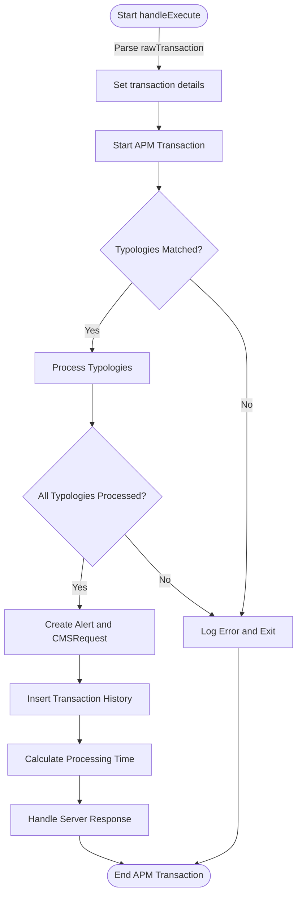

<!-- SPDX-License-Identifier: Apache-2.0 -->

# 5. Transaction Aggregation and Decisioning Processor (TADP)

The sequence diagram below for the Transaction Aggregation and Decisioning Processor

## Overview

### Services

- [PostgresQL](https://www.postgresql.org/): Database Management
- [NATS](https://nats.io): Message queue

You also need NodeJS to be installed in your system. The current [LTS](https://nodejs.org/en) should be suitable. Please open an issue if the application fails to build on the current LTS version. Unix platforms, you should be able to find `nodejs` in your package manager's repositories.

#### Setting Up

```sh
git clone transaction-aggregation-decisioning-processor
cd transaction-aggregation-decisioning-processor
```

You then need to configure your environment: a [sample](.env.template) configuration file has been provided and you may adapt that to your environment. Copy it to `.env` and modify as needed:

```sh
cp .env.template .env
```

A [registry](https://github.com/tazama-lf/docs/blob/f292c9ddabf52d6fe62addc1c61957419ed4ad05/Technical/processor-startup-config-registry.md) of environment variables is provided to provide more context for what each variable is used for.

##### Additional Variables
| Name                                   | Purpose                                     | Example                   |
|----------------------------------------|---------------------------------------------|---------------------------|
| `SUPPRESS_ALERTS`                      | Suppress forwarding report to NATS producer | `false`                   |
| `RAW_HISTORY_DATABASE`                 | PostgreSQL database name                    | `raw_history`             |
| `RAW_HISTORY_DATABASE_HOST`            | PostgreSQL hostname or endpoint             | `localhost`               |
| `RAW_HISTORY_DATABASE_PORT`            | PostgreSQL post used                        | `5432`                    |
| `RAW_HISTORY_DATABASE_USER`            | PostgreSQL username                         | `root`                    |
| `RAW_HISTORY_DATABASE_PASSWORD`        | PostgreSQL database password                | `password`                |
| `RAW_HISTORY_DATABASE_CERT_PATH`       | PostgreSQL certificate path                 | `/path/to/cert`           |
| `EVALUATION_DATABASE`                  | PostgreSQL database name                    | `evaluation`              |
| `EVALUATION_DATABASE_HOST`             | PostgreSQL hostname or endpoint             | `localhost`               |
| `EVALUATION_DATABASE_PORT`             | PostgreSQL post used                        | `5432`                    |
| `EVALUATION_DATABASE_USER`             | PostgreSQL username                         | `root`                    |
| `EVALUATION_DATABASE_PASSWORD`         | PostgreSQL database password                | `password`                |
| `EVALUATION_DATABASE_CERT_PATH`        | PostgreSQL certificate path                 | `/path/to/cert`           |
| `CONFIGURATION_DATABASE`               | PostgreSQL database name                    | `configuration`           |
| `CONFIGURATION_DATABASE_HOST`          | PostgreSQL hostname or endpoint             | `localhost`               |
| `CONFIGURATION_DATABASE_PORT`          | PostgreSQL post used                        | `5432`                    |
| `CONFIGURATION_DATABASE_USER`          | PostgreSQL username                         | `root`                    |
| `CONFIGURATION_DATABASE_PASSWORD`      | PostgreSQL database password                | `password`                |
| `CONFIGURATION_DATABASE_CERT_PATH`     | PostgreSQL certificate path                 | `/path/to/cert`           |

#### Build and Start

```sh
npm i
npm run build
npm run start
```
## Inputs

```js
{
  typologyResult: TypologyResult; // https://raw.githubusercontent.com/tazama-lf/frms-coe-lib/46d1ec1fc9a07b6556baa4fecd80e09c709ccb1b/src/interfaces/processor-files/TypologyResult.ts
  transaction: Pacs002; // https://raw.githubusercontent.com/tazama-lf/frms-coe-lib/cb464248be1efc45ba2701131e75fcf89c478baf/src/interfaces/Pacs.002.001.12.ts
  networkMap: NetworkMap; // https://raw.githubusercontent.com/tazama-lf/frms-coe-lib/aad0f12d07a82dd948fa9d8033f96e9bf8cb3dde/src/interfaces/NetworkMap.ts
  metaData?: {
    prcgTmDp: number;
    prcgTmCRSP: number;
}
```
Where the `transaction` is described as a `Pacs002` message defined [here](https://github.com/tazama-lf/frms-coe-lib/blob/dev/src/interfaces/Pacs.002.001.12.ts)

### Code Activity Diagram



 - **Start handleExecute**: Initiation of the handleExecute function.
 - **Set transaction details**: Parsing and extracting data from rawTransaction into usable variables.
 - **Start APM Transaction**: Begin a transaction monitoring session to track performance.
 - **Typologies Matched?**: Checks if there are any matching typologies for the transaction.
 - **Process Typologies**: Process matching typologies if found.
 - **All Typologies Processed?**: Verifies if all typologies were processed.
 - **Create Alert and CMSRequest**: Constructs an alert and formats the CMS request if all typologies are processed.
 - **Insert Transaction History**: Inserts a record of the transaction into the database.
 - **Calculate Processing Time**: Calculates the time taken to process the transaction.
 - **Handle Server Response**: Sends a response back through the server.
 - **End APM Transaction**: Marks the end of the APM transaction session.
 - **Log Error and Exit**: Logs any errors encountered during the process and exits the function if any step fails significantly.

## Outputs
The output is the input with an added [tadpResult](https://github.com/tazama-lf/frms-coe-lib/blob/dev/src/interfaces/processor-files/TADPResult.ts):

```js
{
  typologyResult: TypologyResult; // https://raw.githubusercontent.com/tazama-lf/frms-coe-lib/46d1ec1fc9a07b6556baa4fecd80e09c709ccb1b/src/interfaces/processor-files/TypologyResult.ts
  transaction: Pacs002; // https://raw.githubusercontent.com/tazama-lf/frms-coe-lib/cb464248be1efc45ba2701131e75fcf89c478baf/src/interfaces/Pacs.002.001.12.ts
  networkMap: NetworkMap; // https://raw.githubusercontent.com/tazama-lf/frms-coe-lib/aad0f12d07a82dd948fa9d8033f96e9bf8cb3dde/src/interfaces/NetworkMap.ts
  metaData?: {
    prcgTmDp: number;
    prcgTmCRSP: number;
  },
  tadpResult: TADPResult;
}
```